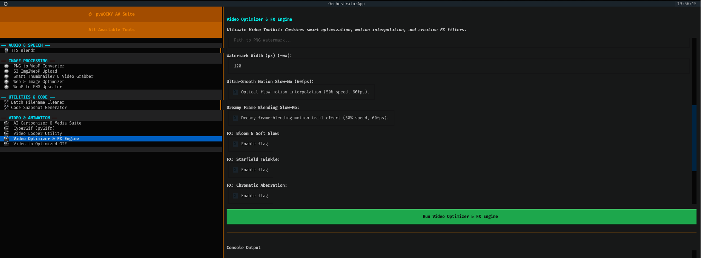

# 🎛️ pywocky
## Media Management Suite & TUI Orchestrator

■◤◢◤◢◤◢◤◢◤◢■■■■■■■■■■■■■■■■■■■■■■■■■■■■■■■■■■■■■■■■■■■■■■■■■■■■■◣◥◣◥◣◥◣◥◣◥■

[](https://www.python.org/downloads/)
[](#-installation--global-setup)
[](https://github.com/Textualize/textual)
[](https://ffmpeg.org/)
[](#-git-submodule-integration)
[](https://opensource.org/licenses/MIT)

**`pywocky`** is a unified, system-wide terminal command and interactive TUI orchestrator built to manage media processing, video optimization, batch image conversions, text-to-speech synthesis, and cloud sync pipelines from anywhere in your terminal.

Powered by **Textual**, `pywocky` dynamically generates user interface forms from simple YAML definitions, routes subprocess executions to isolated virtual environments, and suspends itself to launch full interactive terminal sub-applications (like **`tts-blendr`**).



■◤◢◤◢◤◢◤◢◤◢■■■■■■■■■■■■■■■■■■■■■■■■■■■■■■■■■■■■■■■■■■■■■■■■■■■■■◣◥◣◥◣◥◣◥◣◥■

## ✨ Key Features

* **🌐 Global `pywocky` CLI Command**: Installed via `pipx` or editable `pip` packages—type `pywocky` anywhere in your terminal to launch the interface regardless of your current directory.
* **⚡ Dynamic YAML Manifest Engine**: Drop a `.yaml` file into `pywocky/tools/` and `pywocky` auto-generates forms, text validation, dropdown selects, and shell execution workflows.
* **🚀 Interactive Sub-App Suspension**: Launches standalone TUI tools (like `tts-blendr`) seamlessly using Textual's `self.suspend()`, handing full TTY control to child apps before cleanly returning to `pywocky`.
* **🧠 Smart Virtual Environment Routing**: Auto-detects and targets tool-specific virtual environments (`.venv`), allowing the primary TUI to run on standard runtimes while routing ML tools to isolated environments (e.g. Python 3.12 for `onnxruntime`).
* **🎨 Categorized & Stylized Sidebar**: Automatic categorization and icon tagging (`🖼️ Image Processing`, `🎬 Video & Animation`, `🎙️ Audio & Speech`, `🛠️ Utilities & Code`).
* **🍎 Apple Silicon GPU Acceleration**: Native integration with macOS **VideoToolbox** (`hevc_videotoolbox` / `h264_videotoolbox`) for ultra-fast HEVC/H.265 video encoding and 10-bit LUT color workflows.
* **ONNX Powered Text to Speech Local AI**: Using [TTS-BLENDR](https://github.com/huement/tts-blendr) you can turn text files into custom totally unique blended voices locally using HuggingFace AI Models that run on basic hardware. 

■◤◢◤◢◤◢◤◢◤◢■■■■■■■■■■■■■■■■■■■■■■■■■■■■■■■■■■■■■■■■■■■■■■■■■■■■■◣◥◣◥◣◥◣◥◣◥■

## 📁 Repository Architecture

```text
cli-media-res/
├── pyproject.toml              # Modern Python package specs & 'pywocky' CLI entrypoint
├── requirements.txt            # Suite-wide dependency specifications
├── pywocky/                    # Core Orchestrator Package
│   ├── app.py                  # Main Textual Orchestrator Application
│   └── tools/                  # YAML tool definitions & UI manifests
│       ├── media_optimize.yaml
│       ├── pygifr.yaml
│       ├── s3upload.yaml
│       ├── thumbnails.yaml
│       └── tts_blendr.yaml
├── file_mgmt/                  # Native Python File Management Tools
│   ├── png2webp.py             # Batch PNG -> WebP converter
│   ├── rename.py               # Substring batch filename cleaner
│   ├── s3upload.py             # S3/MinIO cloud sync with WebP auto-conversion
│   └── webp2png.py             # WebP -> 1:1 PNG + 150% Lanczos upscaler
├── optimize_scripts/           # Consolidated Optimization Suite
│   ├── optimize_images.py      # In-place JPEG/PNG compression & WebP generator
│   └── thumbnailer.py          # Smart-crop thumbnailer & video frame extractor
├── vid_mog/                    # Video Processing & FX Pipeline
│   ├── media_optimize.py       # GPU based video optimizer & LUT engine
│   ├── cartoon-cli.sh          # AI Video Stylizer
│   └── glitch-cli.sh           # RGB shift & glitch video filters
├── gifs/                       # GIF Creation Suite
│   ├── pyGifr.py               # Auto-bounding-box animated GIF compiler
│   └── vid2gif.py              # High-compression Video-to-GIF converter
├── submodules/                 # External Integrated Projects
│   └── tts-blendr/             # Voice synthesis and dual-voice blending TUI
└── code_snapshots/             # Terminal code screenshot tools
```

# 🚀 Installation & Global Setup
pywocky is designed to be installed in **Editable Mode** using pipx. This exposes the global pywocky command system-wide while reflecting any local script or YAML edits instantly.

### 1\. Prerequisites (macOS / Linux)
Ensure core system dependencies are installed via Homebrew:

```bash
# Install FFmpeg with Apple VideoToolbox support
brew install ffmpeg ffprobe
```

### 2\. Install pywocky Globally (Option 1)
Clone the repository and install it using pipx:

```bash
git clone --recursive [https://github.com/huement/cli-media-res.git](https://github.com/huement/cli-media-res.git)
cd cli-media-res

# Install pywocky globally with all optional media dependencies

pipx install --editable ".[all]"
```

*(Note: If using standard virtual environments instead of pipx, run pip install -e ".[all]" inside your active venv.)*

You can also edit the `.[all]` for smaller options if you only plan on using a specific subset of the tools. For all the available options see this file `/pywocky.egg-info/requires.txt`

### 3\. Initialize Git Submodules (TTS Blendr)

For more information about TTS-Blendr head over to its repository here: [https://github.com/huement/tts-blendr](https://github.com/huement/tts-blendr). It uses the exact same textual UI library as pyWocky and works in much the same manor, its focus is only on generating speech from text files, which allows it to seemless fit into this larger Audio / Visual application. 

```bash
tts-blendr runs inside its own isolated Python 3.12 environment:

# Initialize submodules

git submodule update --init --recursive
```

# Create a Python 3.12 virtual environment for tts-blendr

```bash
python3.12 -m venv submodules/tts-blendr/.venv
./submodules/tts-blendr/.venv/bin/pip install -r submodules/tts-blendr/requirements.txt
```

# 🎛️ Usage
Once installed, simply type **pywocky** in any terminal window:

```bash
pywocky
```
### 🛠️ Adding New Tools via YAML
You can integrate any Python or Bash script into pywocky without editing the core application code. Just create a new .yaml file inside pywocky/tools/:

```yaml
id: "my_tool"
name: "My Custom Tool"
category: "Utilities & Code"
icon: "🛠️"
script_path: "file_mgmt/my_script.py"
description: "Process files automatically using custom arguments."

arguments:
- name: "Target Directory"
  flag: "" # Blank flag = Positional argument
  type: "file"
  default: "."
  required: true

- name: "Compression Level"
  flag: "--level"
  type: "integer"
  default: "5"

- name: "Enable Hard Core Mode"
  flag: "--hardcore"
  type: "boolean"
  default: false
```

### 🚀 Interactive TUI Tools
For tools that feature their own native Textual interface (like tts-blendr), set interactive: true in their YAML definition. pywocky will automatically suspend itself and hand full control of the terminal to the child app when launched:

```yaml
id: "tts_blendr"
name: "TTS Blendr"
category: "Audio & Speech"
icon: "🎙️"
script_path: "submodules/tts-blendr/main.py"
venv_path: "submodules/tts-blendr/.venv"
interactive: true
 ```
 
# 🧰 Summary of Included Tools

| **Category** | **Tool** | **Description** |
|---|---|---|
| **🎙️ Audio & Speech** | **TTS Blendr** | Voice synthesis & dual-voice blending TUI *(Interactive)* |
| **🖼️ Image Processing** | **Web & Image Optimizer** | Max compression in-place + auto WebP creation |
|  | **Smart Thumbnailer** | Distortion-free smart cropping & video frame capture |
|  | **PNG to WebP** | Fast batch PNG to WebP conversion |
|  | **WebP to PNG** | WebP to 1:1 PNG + 150% Lanczos upscaling |
|  | **S3 Sync & Upload** | S3/MinIO bucket folder sync with on-the-fly WebP conversion |
| **🎬 Video & Animation** | **Video Optimizer & FX** | Hardware-accelerated HEVC/H.264, 10-bit LUTs, & FX |
|  | **CyberGif (pyGifr)** | Auto-bounding box folder GIF & MP4 compiler |
|  | **Video to GIF** | High-compression video-to-GIF converter |
| **🛠️ Utilities & Code** | **Batch Filename Cleaner** | Strip unwanted substrings from folder filenames |
|  | **Code Snapshots** | Code screenshot generator |


# 📄 License & Sponsorship
Distributed freely under the open-source **MIT License**. Engineered and maintained by **[HUEMENT](https://huement.com/)**.
**Need a custom feature or video pipeline built?** I perform freelance software engineering and automation work. [Contact HUEMENT Here](https://huement.com/contact).
